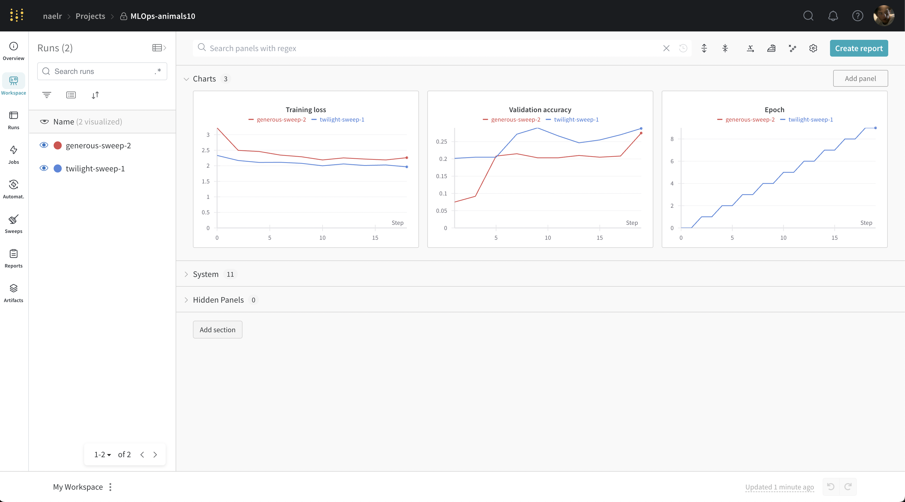
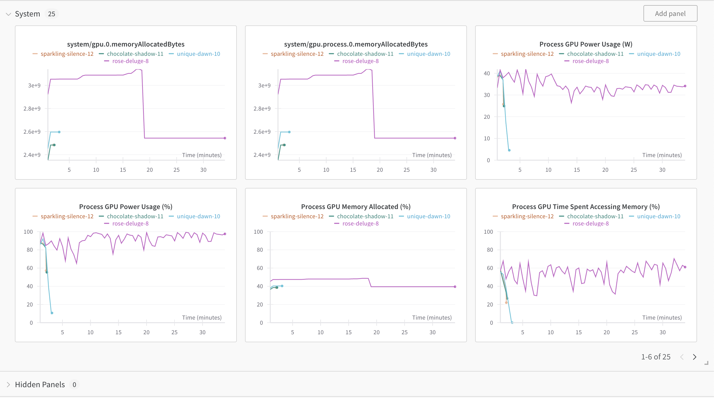
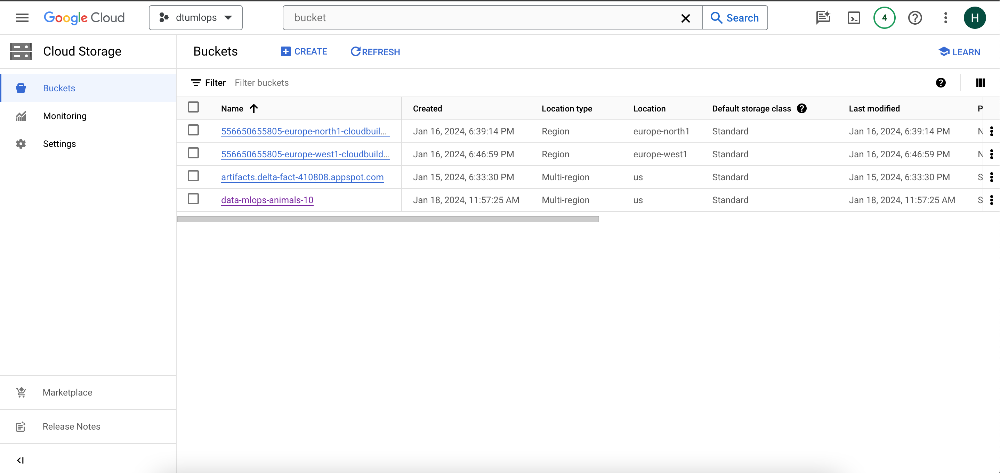
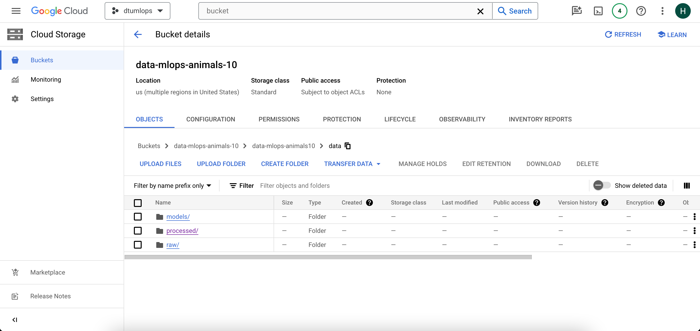
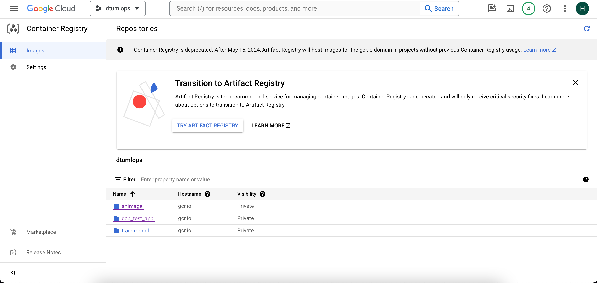
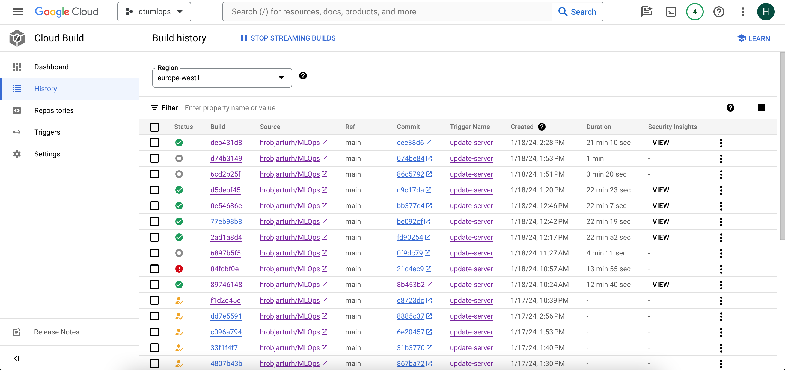
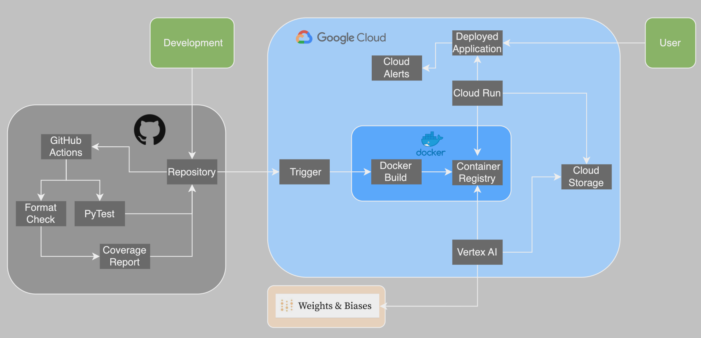

# Exam template for 02476 Machine Learning Operations

This is the report template for the exam. Please only remove the text formatted as with three dashes in front and behind
like:

`--- question 1 fill here ---`

where you instead should add your answers. Any other changes may have unwanted consequences when your report is auto
generated in the end of the course. For questions where you are asked to include images, start by adding the image to
the `figures` subfolder (please only use `.png`, `.jpg` or `.jpeg`) and then add the following code in your answer:

```markdown

```

In addition to this markdown file, we also provide the `report.py` script that provides two utility functions:

Running:

```bash
python report.py html
```

will generate an `.html` page of your report. After deadline for answering this template, we will autoscrape
everything in this `reports` folder and then use this utility to generate an `.html` page that will be your serve
as your final handin.

Running

```bash
python report.py check
```

will check your answers in this template against the constrains listed for each question e.g. is your answer too
short, too long, have you included an image when asked to.

For both functions to work it is important that you do not rename anything. The script have two dependencies that can
be installed with `pip install click markdown`.

## Overall project checklist

The checklist is _exhaustic_ which means that it includes everything that you could possible do on the project in
relation the curricilum in this course. Therefore, we do not expect at all that you have checked of all boxes at the
end of the project.

### Week 1

- [x] Create a git repository
- [x] Make sure that all team members have write access to the github repository
- [x] Create a dedicated environment for you project to keep track of your packages
- [x] Create the initial file structure using cookiecutter
- [x] Fill out the `make_dataset.py` file such that it downloads whatever data you need and
- [x] Add a model file and a training script and get that running
- [x] Remember to fill out the `requirements.txt` file with whatever dependencies that you are using
- [x] Remember to comply with good coding practices (`pep8`) while doing the project
- [x] Do a bit of code typing and remember to document essential parts of your code
- [x] Setup version control for your data or part of your data
- [x] Construct one or multiple docker files for your code
- [x] Build the docker files locally and make sure they work as intended
- [x] Write one or multiple configurations files for your experiments
- [x] Used Hydra to load the configurations and manage your hyperparameters
- [ ] When you have something that works somewhat, remember at some point to to some profiling and see if
      you can optimize your code
- [x] Use Weights & Biases to log training progress and other important metrics/artifacts in your code. Additionally,
      consider running a hyperparameter optimization sweep.
- [ ] Use Pytorch-lightning (if applicable) to reduce the amount of boilerplate in your code

### Week 2

- [x] Write unit tests related to the data part of your code
- [x] Write unit tests related to model construction and or model training
- [x] Calculate the coverage.
- [x] Get some continuous integration running on the github repository
- [x] Create a data storage in GCP Bucket for you data and preferable link this with your data version control setup
- [x] Create a trigger workflow for automatically building your docker images
- [x] Get your model training in GCP using either the Engine or Vertex AI
- [x] Create a FastAPI application that can do inference using your model
- [ ] If applicable, consider deploying the model locally using torchserve
- [x] Deploy your model in GCP using either Functions or Run as the backend

### Week 3

- [ ] Check how robust your model is towards data drifting
- [x] Setup monitoring for the system telemetry of your deployed model
- [ ] Setup monitoring for the performance of your deployed model
- [ ] If applicable, play around with distributed data loading
- [ ] If applicable, play around with distributed model training
- [ ] Play around with quantization, compilation and pruning for you trained models to increase inference speed

### Additional

- [x] Revisit your initial project description. Did the project turn out as you wanted?
- [x] Make sure all group members have a understanding about all parts of the project
- [x] Uploaded all your code to github

## Group information

### Question 1

> **Enter the group number you signed up on <learn.inside.dtu.dk>**
>
> Answer:

19

### Question 2

> **Enter the study number for each member in the group**
>
> Example:
>
> _sXXXXXX, sXXXXXX, sXXXXXX_
>
> Answer: s213820, s184677, s144841, s230374

### Question 3

> **What framework did you choose to work with and did it help you complete the project?**
>
> Answer length: 100-200 words.
>
> Example:
> _We used the third-party framework ... in our project. We used functionality ... and functionality ... from the_ > _package to do ... and ... in our project_.
>
> Answer:

We used the `torchvision` framework, and specifically the `models` module, which provides a suite of pre-defined model architectures and even pre-trained weights. We have used the pre-defined model GoogLeNet found [here](https://github.com/pytorch/vision/blob/main/torchvision/models/googlenet.py).

As a default, the model is set up with an output dimension of 1000, to classify the ImageNet dataset. The dataset we use only has 10 classes, so it is necessary to specify this when instantiating the model.

We initialize the weights randomly, as we are interested in training the model ourselves and conduct experiments with regard to the training process.

Using the out-of-the-box model from torchvision was a great help in getting started with the project, as it required minimal code and only small adjustments to make it work. One important thing is that the input dimension is of the correct shape - image should be 3 color channels and size should be minimum 224 in the case of GoogLeNet, as described in the documentation [here](https://pytorch.org/hub/pytorch_vision_googlenet/).

## Coding environment

> In the following section we are interested in learning more about you local development environment.

### Question 4

> **Explain how you managed dependencies in your project? Explain the process a new team member would have to go** > **through to get an exact copy of your environment.**
>
> Answer length: 100-200 words
>
> Example:
> _We used ... for managing our dependencies. The list of dependencies was auto-generated using ... . To get a_ > _complete copy of our development environment, one would have to run the following commands_
>
> Answer:

We have used the Conda package manager to manage dependencies. The environment.yml file contains everything that is needed to run and develop the project. To get a copy of the environment, the new team member would simply have to clone the repository, and then use the command `conda env create -f environment.yml`.

Of course, the environment may change over the course of development, so it should be commited frequently to the repository.

### Question 5

> **We expect that you initialized your project using the cookiecutter template. Explain the overall structure of your** > **code. Did you fill out every folder or only a subset?**
>
> Answer length: 100-200 words
>
> Example:
> _From the cookiecutter template we have filled out the ... , ... and ... folder. We have removed the ... folder_ > _because we did not use any ... in our project. We have added an ... folder that contains ... for running our_ > _experiments._
> Answer:

Our code is structured using the MLOps cookiecutter template. Everything that is run as part of the project is in the project folder, while everything else (data files, model files, config files) are in the root directory.

We have filled out the following folders: data, dockerfiles, models, notebooks, reports, tests, and of course the project itself (animals10).

In addition to these, we also added a config folder, which holds the YAML files for setting up experiments. We also have a cloudbuild folder, which contains the YAML file that builds the docker image for deploying the model.

We have not filled out the docs folder, since this is just a demo project not meant for long-term maintenance. However, for documentation, we have tried to comment code and make use of docstrings where relevant.

### Question 6

> **Did you implement any rules for code quality and format? Additionally, explain with your own words why these** > **concepts matters in larger projects.**
>
> Answer length: 50-100 words.
>
> Answer:

For formatting we have used ruff linting and formatting. Additionally, we have written docstrings for the trickier/more complex parts of the code. It is important to document the work in larger projects, because otherwise your colleagues (and future-you) will not understand the code. This leads to technical debt in the long-term. Documenting code ad hoc is an investment, but it will lead to much better, understandable and maintainable code in the future.

## Version control

> In the following section we are interested in how version control was used in your project during development to
> corporate and increase the quality of your code.

### Question 7

> **How many tests did you implement and what are they testing in your code?**
>
> Answer length: 50-100 words.
>
> Example:
> _In total we have implemented X tests. Primarily we are testing ... and ... as these the most critical parts of our_ > _application but also ... ._
>
> Answer:

We focused on creating tests for the training process and the data. We designed a test for the Loader, which is a module created for this project to load data from the cloud to be used. We test that the data is in the right location and has the right shape. We tested that the training process works and is able to load the correct data, that it saves the model correctly and in the right place.

### Question 8

> **What is the total code coverage (in percentage) of your code? If you code had an code coverage of 100% (or close** > **to), would you still trust it to be error free? Explain you reasoning.**
>
> Answer length: 100-200 words.
>
> The total code coverage is 84%, which includes most of our soruce code including our data, Loader object, model and model training. We are not far from 100% coverage and it would probably also be beneficial to have some unittests that test our FastAPI application and our prediction script. This could perhaps done by testing if we can connect to the API and that it returns the correct output format. Furthermore, a unittest on the GCP would also be beneficial. Even with a 100% coverage there is no guarentee that our code is bug free since there might still be conor cases that we havent tested for. However, with a 100% coverage we atleast have a good indication that our code is tested for bugs and we may very likely catch a lot of bugs in that process.
>
> Answer:

--- question 8 fill here ---

### Question 9

> **Did you workflow include using branches and pull requests? If yes, explain how. If not, explain how branches and** > **pull request can help improve version control.**
>
> Answer length: 100-200 words.
>
> Example:
> _We made use of both branches and PRs in our project. In our group, each member had an branch that they worked on in_ > _addition to the main branch. To merge code we ..._
>
> Answer:

For small changes, commits directly to the main branch with a descriptive message was tolerated. However, if the code change spanned more than just a few lines, we made use of branches and PRs. This enables everyone to see which changes are in progress, and what parts of the project are being actively developed.

We did not really implement a single naming convention for the branches. One naming convention is "type/subject". And so, if we were developing the training script, the branch would be "feature/trainmodel". Other types could be _bugfix, experimental, WIP_.

Another naming convention is to use the ititials of the developer, and then the subject, e.g. "john/trainmodel". This was, everyone can easily see who is working on what.

For smaller projects, like this one, it can also be alright to just use the subject of the branch as the name, e.g. "trainmodel". But for larger projects it is good to have a naming convention.

PRs are used to merge temporary branches into the main branch, and are a good way to describe in natural language the changes made in the branch. The author can highlight important changes, and explain concepts. However, documentation within the code itself should also be present for future debugging.

### Question 10

> **Did you use DVC for managing data in your project? If yes, then how did it improve your project to have version** > **control of your data. If no, explain a case where it would be beneficial to have version control of your data.**
>
> Answer length: 100-200 words.
>
> Example:
> _We did make use of DVC in the following way: ... . In the end it helped us in ... for controlling ... part of our_ > _pipeline_
>
> Answer:

We did not use Data Version Control (DVC) in our project, mainly because our dataset remained fixed and did not undergo changes throughout the experiments. However, in scenarios where data modifications are likely, DVC is very useful. For instance, if we were to acquire additional images or explore different preprocessing techniques, DVC could help with managing dataset versions.

It would be beneficial to be able to checkout different data versions, as part of being able to reproduce experiments. Of course, the hyperparameters, including the random seed, used to train a model, are important for reproduceability. But the data used as input is also extremely important. If we were to test how different preprocessing techniques affect model performance, DVC could help with this.

### Question 11

> **Discuss you continues integration setup. What kind of CI are you running (unittesting, linting, etc.)? Do you test** > **multiple operating systems, python version etc. Do you make use of caching? Feel free to insert a link to one of** > **your github actions workflow.**
>
> Answer length: 200-300 words.
>
> Example:
> _We have organized our CI into 3 separate files: one for doing ..., one for running ... testing and one for running_ > _... . In particular for our ..., we used ... .An example of a triggered workflow can be seen here: <weblink>_
>
> Answer:

We incorporated a Github action that is located in:

> .github/workflows/tests.yml

This action generates a report using the coverage package:

> coverage run -m pytest tests/

This results in a report being created that is uploaded as an artifact.

We then use the linter ruff by checking that all the files are formatted correclty.

## Running code and tracking experiments

> In the following section we are interested in learning more about the experimental setup for running your code and
> especially the reproducibility of your experiments.

### Question 12

> **How did you configure experiments? Did you make use of config files? Explain with coding examples of how you would** > **run a experiment.**
>
> Answer length: 50-100 words.
>
> Example:
> _We used a simple argparser, that worked in the following way: python my_script.py --lr 1e-3 --batch_size 25_
>
> Answer:

To configure experiments we used a combination of config files and CLI arguments, with an option for using Weights&Bias Sweeps. The config.yaml file in the config folder holds some default hyperparameters, and running the training without any command line arguments results in the experiement being run with the default parameters: `python train_model.py`

To overwrite the parameters directly for a single run, additional arguments for any of the hyperparameters can be provided: `python train_model.py learning_rate=0.01 batch_size=32`.

To configure a sweep, the developer should create a sweep.yaml file in the config folder and run: `wandb sweep sweep.yaml`.

### Question 13

> **Reproducibility of experiments are important. Related to the last question, how did you secure that no information** > **is lost when running experiments and that your experiments are reproducible?**
>
> Answer length: 100-200 words.
>
> Example:
> _We made use of config files. Whenever an experiment is run the following happens: ... . To reproduce an experiment_ > _one would have to do ..._
>
> Answer:

It's challenging to guarantee that no information is lost, but we implement practices to enhance reproducibility. We employ configuration files to systematically define experiment parameters, providing a clear and documented blueprint for each experiment. This minimizes the risk of oversight and aids in recreating experiments precisely.

We also use the Weights and Biases (W&B) platform to log comprehensive details of our experiments, including hyperparameters, metrics, and artifacts. This not only facilitates result tracking but also enables others to replicate our experiments.

Furthermore, we containerize our training environment using Docker. By encapsulating dependencies and configurations within a Docker container, we create a standardized and isolated environment. This ensures that anyone, regardless of their system configuration, can reproduce our experiments consistently. Through this combination of configuration files, W&B logging, and Docker containerization, we achieve reproducibility of our experiments.

### Question 14

> **Upload 1 to 3 screenshots that show the experiments that you have done in W&B (or another experiment tracking** > **service of your choice). This may include loss graphs, logged images, hyperparameter sweeps etc. You can take** > **inspiration from [this figure](figures/wandb.png). Explain what metrics you are tracking and why they are** > **important.**
>
> Answer length: 200-300 words + 1 to 3 screenshots.
>
> Example:
> _As seen in the first image when have tracked ... and ... which both inform us about ... in our experiments._ > _As seen in the second image we are also tracking ... and ..._
>
> Answer:
> In our experimentation, we monitor several metrics to gauge the performance and effectiveness of our models. Firstly, we track the training loss, which provides insights into how well our model is learning from the training data. A decreasing training loss indicates that the model is converging and effectively minimizing the difference between predicted and actual values. This metric is crucial for assessing the model's training progress and identifying potential issues, such as overfitting or underfitting.

Validation accuracy is another important metric we monitor. It measures the model's performance on a separate dataset not used during training, giving an indication of its generalization capabilities. A high validation accuracy signifies that the model is good at making accurate predictions on unseen data.

Additionally, since one of our group members has a GPU, we can also track GPU utilization. This metric can show how efficiently the model/training is utilizing available hardware resources. Optimizing GPU utilization ensures that computational power is maximized, contributing to faster training times and more effective utilization of hardware capabilities. By itself, GPU util only gives an indication of how the program is running, and should be combined with profiling tools to actually inspect and understand what operations are being executed and for how long.

By comprehensively tracking these metrics using the Weights and Bias framework, we gain a comprehensive understanding of our model's performance, enabling informed decisions and iterative improvements throughout the development process.




### Question 15

> **Docker is an important tool for creating containerized applications. Explain how you used docker in your** > **experiments? Include how you would run your docker images and include a link to one of your docker files.**
>
> Answer length: 100-200 words.
>
> Example:
> _For our project we developed several images: one for training, inference and deployment. For example to run the_ > _training docker image: `docker run trainer:latest lr=1e-3 batch_size=64`. Link to docker file: <weblink>_
>
> Answer:

All of our dockerfiles are stored in

> dockerfiles/

We dockerized our application and training process through a yaml file that is called when the cloud trigger is activated. We first build the docker image using the cloud:

```
  - name: "gcr.io/cloud-builders/docker"
    args:
      [
        "build",
        "-f",
        "dockerfiles/server_model.dockerfile",
        "-t",
        "gcr.io/delta-fact-410808/animage:latest",
        ".",
      ]
```

Here we define the dockerfile we want to execute, project id on the cloud and the name of the image that is built.

Then we push the image to the container registry:

```
  - name: "gcr.io/cloud-builders/docker"
    args: ["push", "gcr.io/delta-fact-410808/animage:latest"]
```

Now the image can be used by othe cloud functionality such as the Vertex AI and the Cloud Run functionality.

### Question 16

> **When running into bugs while trying to run your experiments, how did you perform debugging? Additionally, did you** > **try to profile your code or do you think it is already perfect?**
>
> Answer length: 100-200 words.
>
> Example:
> _Debugging method was dependent on group member. Some just used ... and others used ... . We did a single profiling_ > _run of our main code at some point that showed ..._
>
> Answer:

When encountering bugs during our experiments, we adopted a systematic approach to debugging. We utilized the Python debugger, leveraging the `breakpoint()` method to inspect variable values and trace the flow of our code. To expedite the debugging process, we streamlined our experiments, limiting them to a single epoch, one data batch, and one validation batch. This allowed for faster iterations and pinpointing specific issues.

While we acknowledge that our code is not flawless, we haven't implemented profiling. We recognize the potential benefits of profiling tools in identifying bottlenecks and optimizing performance. Profiling can offer valuable insights into the runtime behavior of our code, helping address inefficiencies and enhance overall execution.

## Working in the cloud

> In the following section we would like to know more about your experience when developing in the cloud.

### Question 17

> **List all the GCP services that you made use of in your project and shortly explain what each service does?**
>
> Answer length: 50-200 words.
>
> Example:
> _We used the following two services: Engine and Bucket. Engine is used for... and Bucket is used for..._
>
> Answer:

- Container Registry: Store docker images and docker containers.

- Cloud Run: Deployes and hosts applications. We used it to host the backend server for our model.

- Cloud Build: Automates the building and deployment process by connecting to repositories and executing triggers at predefined times. We used the triggers function to update the deployed model when the source code is updated.

- Cloud Storage: Used to store repositories. We used it to store our processed data as well as trained models.
  ´
- Vertex AI: Toolbox for AI development and deployment. We used it to train our model.

- Cloud Alerts: Monitors a process and alerts the user if a pre-defined condition is met.

### Question 18

> **The backbone of GCP is the Compute engine. Explained how you made use of this service and what type of VMs** > **you used?**
>
> Answer length: 100-200 words.
>
> Example:
> _We used the compute engine to run our ... . We used instances with the following hardware: ... and we started the_ > _using a custom container: ..._
>
> Answer:

We utilised the compute engine indirectly, through Vertex AI. We used Vertex AI to accelerate the setup proccess and perform the training of our model. For the training itself we initialised the general-purpose virtual machine type n1-highmem-32. Through a trigger we dockerise the training process and store it in the container registry. Then we create a custom job where we specify the region, machine type and the WandB connection, which logs the training process.

### Question 19

> **Insert 1-2 images of your GCP bucket, such that we can see what data you have stored in it.** > **You can take inspiration from [this figure](figures/bucket.png).**
>
> Answer:




### Question 20

> **Upload one image of your GCP container registry, such that we can see the different images that you have stored.** > **You can take inspiration from [this figure](figures/registry.png).**
>
> Answer:



### Question 21

> **Upload one image of your GCP cloud build history, so we can see the history of the images that have been build in** > **your project. You can take inspiration from [this figure](figures/build.png).**
>
> Answer:



### Question 22

> **Did you manage to deploy your model, either in locally or cloud? If not, describe why. If yes, describe how and** > **preferably how you invoke your deployed service?**
>
> Answer length: 100-200 words.
>
> Example:
> _For deployment we wrapped our model into application using ... . We first tried locally serving the model, which_ > _worked. Afterwards we deployed it in the cloud, using ... . To invoke the service an user would call_ > _`curl -X POST -F "file=@file.json"<weburl>`_
>
> Answer:

The model application can be deployed both locally and in the cloud. To deploy it locally a user can simply run the following command

> uvicorn --reload --port 8000 animals10.serve:app

or call the make function

> make serve

The cloud application is deployed automatiaclly via a trigger that is executed when the github main brach has been pushed. This dockerises an image that is then execuded with the command:

> CMD ["uvicorn", "animals10.serve:app", "--host", "0.0.0.0", "--port", "8080"]

It is also possible to deploy the model by running the trigger manually through the cloud run UI on GCP.

### Question 23

> **Did you manage to implement monitoring of your deployed model? If yes, explain how it works. If not, explain how** > **monitoring would help the longevity of your application.**
>
> Answer length: 100-200 words.
>
> Example:
> _We did not manage to implement monitoring. We would like to have monitoring implemented such that over time we could_ > _measure ... and ... that would inform us about this ... behaviour of our application._
>
> Answer:

Monitoring will help the longevity of our application by providing valuable insight into how the users are actually _using_ the app. There might be a great incoherence between the intended usage of the deployed model, and the actual usage. Monitoring is a way to discover this, because without it, how would we ever know what is going on in production?

Our app classifies images into 10 different categories of animals. There are obviously many more types of animals. And even more types of things in general. But that does not restrict users from uploading images of vintage cars and get respones like "cat" og "giraffe". And while it may be fun to find out if your friends car is more cat than giraffe, it may also be an indication that users actually want to classify cars moreso than animals.

We are monitoring the cpu usage of the application. The Cloud Run functionality logs basic usage of the deployed application such as requests, latency, memory and cpu usage etc. We utilised this by implementing a Cloud Alert that monitors the deployed application and sends an alert if the cpu usage is higher than 95%.

This insight can be used to strategize and plan future development of the product. Without the monitoring, we might have thought that users wanted a greater variety of animals, but based on the monitoring we can make data-driven decisions that enhance the user experience in the future.

### Question 24

> **How many credits did you end up using during the project and what service was most expensive?**
>
> Answer length: 25-100 words.
>
> Example:
> _Group member 1 used ..., Group member 2 used ..., in total ... credits was spend during development. The service_ > _costing the most was ... due to ..._
>
> Answer:

- s230374 : $1.17
- s213820 : $3.76
- s144841 : $9.47

In total we only used $14.4 for the entire project which was less than we expected to use. Most of the credits were used on the Vertex AI training process, Followed by the cloud storage.

## Overall discussion of project

> In the following section we would like you to think about the general structure of your project.

### Question 25

> **Include a figure that describes the overall architecture of your system and what services that you make use of.** > **You can take inspiration from [this figure](figures/overview.png). Additionally in your own words, explain the** > **overall steps in figure.**
>
> Answer length: 200-400 words
>
> Example:
>
> _The starting point of the diagram is our local setup, where we integrated ... and ... and ... into our code._ > _Whenever we commit code and puch to github, it auto triggers ... and ... . From there the diagram shows ..._
>
> Answer:

The developer interacts with github. When the developer pushes code to github, then github actions are triggered that check the format of the code and run a test script. A coverage report is then made.

If the branch that is being pushed to is the main branch, then a trigger in the cloud is also created. This trigger dockerises the training process and the application separately. Using vertex AI, the developer can then train the model and the training and validation accuracy is logged to WandB. The training data is stored in the cloud storage and the output model is also stored there in the cloud.

The trigger will also redeploy the application if it is approved. This will take the model from the cloud and deploy it using the Cloud Run functionality.

The application is being monitored with the cloud alert functionality. If the cpu utilisation is over 95 percent, it sends an alert.

A user can now access the deployed model given that they have access.



### Question 26

> **Discuss the overall struggles of the project. Where did you spend most time and what did you do to overcome these** > **challenges?**
>
> Answer length: 200-400 words.
>
> Example:
> _The biggest challenges in the project was using ... tool to do ... . The reason for this was ..._
>
> Answer:

A lot of time went into the Google Cloud Platform. For starters, the platform has a lot of functionality to go through and a lot of options that takes time to research what they do. It also does not help that the platform could be more documented. Sometimes documentation is missing or is old, refering to an older version of the platform. Trial and error was still able to solve most problems.

It also added a lot of debug time, it takes time to dockerise an image, and sometimes waiting 20 minutes to check if you were able to fix a bug can be an unpleasent experience. We solved this by reducing the amount of files that were being dockerised.

Dvc was also taking up a lot of precious development time. We had issues with pulling data and setting up an environment that worked for everybody. We also realised later than we would have wanted that the data.dvc file was larger that expected which was causing problems elsewhere. We solved this by focusing more on the cloud buckets, which led to having easier access to our data.

### Question 27

> **State the individual contributions of each team member. This is required information from DTU, because we need to** > **make sure all members contributed actively to the project**
>
> Answer length: 50-200 words.
>
> Example:
> _Student sXXXXXX was in charge of developing of setting up the initial cookie cutter project and developing of the_ > _docker containers for training our applications._ > _Student sXXXXXX was in charge of training our models in the cloud and deploying them afterwards._ > _All members contributed to code by..._
>
> Answer:

Student s213820 was in charge of setting up the dataset processing, experiment configurations and sweeps in wandb, as well as keeping the code formatted and repository tidy.

Student s184677 was in charge of

Student s144841 was in charge of

Student s230374 was in charge of creating the training and predict method, configuring the data processing to fit the model, creating the model application and hosting it on the cloud.

All members contributed to the code and development of the project.
